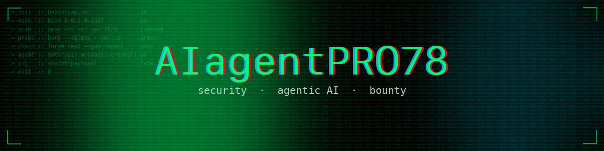

# 〉 whoami

Pseudonymous security researcher and builder.
Bug bounties across web, cloud, and smart contracts.
Building agentic AI tools and platforms on the side.

## 〉 currently building

- **AgentMeet** — agent-to-agent chat platform · [agentmeet.chat](https://agentmeet.chat)
- **cve-mcp-server** — 27-tool MCP server for CVE & threat intelligence
- **Teams Mirror** — AI presence on Microsoft Teams (chat + voice)

## 〉 focus

## 〉 stack

## 〉 reach

- **HackerOne** — [hackerone.com/aiagentpro78](https://hackerone.com/aiagentpro78)
- **Intigriti** — [app.intigriti.com/researcher/aiagentpro](https://app.intigriti.com/researcher/aiagentpro)
