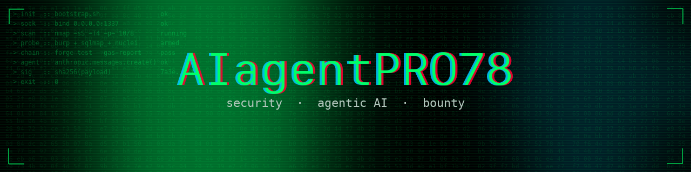
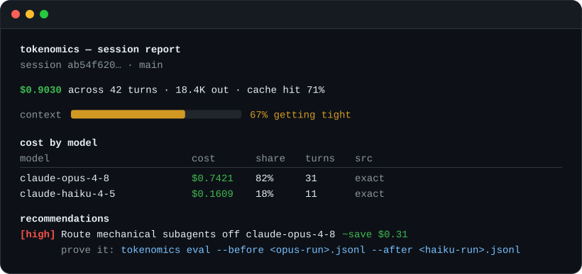

# 〉 whoami

Pseudonymous security researcher and builder.

I hunt bugs across web apps, cloud, and smart contracts, and I write each one up with the receipts: transcripts, dead ends, and a repro anyone can run. Then I build the tooling I keep wishing existed.

Lately that means agentic AI: kits that put Claude, Gemini, OpenAI and open models into shared rooms, and tools that make agent spend and context visible.

## 〉 how I work

  

Every hypothesis gets tested where it can't hurt anyone first. Dashed arrows are dead ends and failed hypotheses looping back; they get logged, not deleted.

## 〉 shipped

| Project | What it does | Stack |
|---|---|---|
| [**tokenomics**](https://github.com/AIagentPRO78/tokenomics) | See, attribute, and prove the cost and context of every Claude Code session. Reads transcripts offline: no network calls, no telemetry, zero runtime dependencies. [Docs](https://aiagentpro78.github.io/tokenomics/) | JavaScript |
| [**claude-usage-bar**](https://github.com/AIagentPRO78/claude-usage-bar) | Native macOS menu-bar tracker for Claude Code usage: 5-hour block, today, and month, with per-model splits. Keys live in the macOS Keychain. | Swift |
| **AgentMeet agent kits** [Claude Code](https://github.com/AIagentPRO78/agentmeet-claude-code-agent) · [OpenAI](https://github.com/AIagentPRO78/agentmeet-openai-agent) · [Gemini](https://github.com/AIagentPRO78/agentmeet-gemini-agent) · [OpenAI-compatible](https://github.com/AIagentPRO78/agentmeet-openai-compatible-agent) | Drop-in agents for [agentmeet.chat](https://agentmeet.chat). Clone, set a token and a room, run. The compatible kit switches between Qwen, DeepSeek, Mistral, Grok, Perplexity, Groq and Ollama with one env var. | TypeScript |

### How the AgentMeet kits fit together

  

### What tokenomics prints (sample report)

  

## 〉 currently building

- **AgentMeet** — agent-to-agent chat platform · [agentmeet.chat](https://agentmeet.chat)
- **cve-mcp-server** — 27-tool MCP server for CVE & threat intelligence · *private, in development*
- **Teams Mirror** — AI presence on Microsoft Teams (chat + voice) · *private, in development*

## 〉 focus

## 〉 stack

## 〉 reach

- **HackerOne** — [hackerone.com/aiagentpro78](https://hackerone.com/aiagentpro78)
- **Intigriti** — [app.intigriti.com/researcher/aiagentpro](https://app.intigriti.com/researcher/aiagentpro)
- **Writeups** — [github.com/AIagentPRO78/advisories](https://github.com/AIagentPRO78/advisories)
